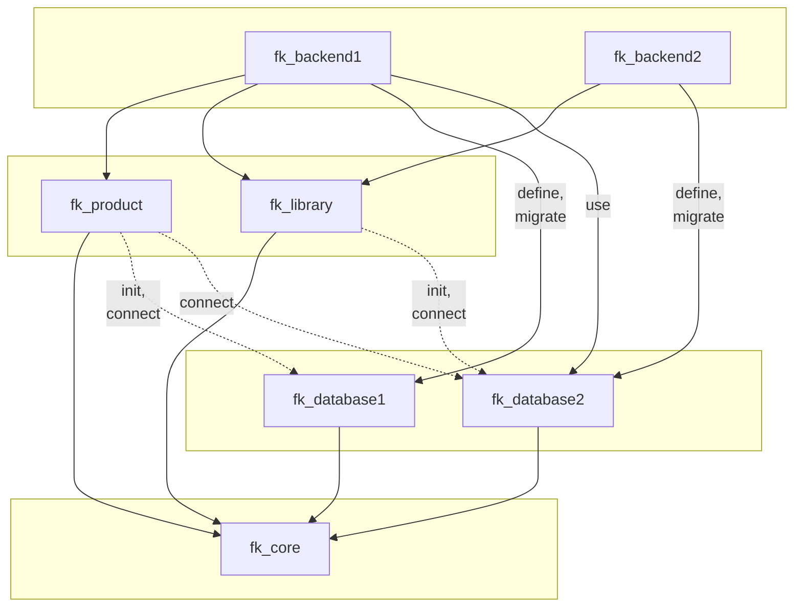
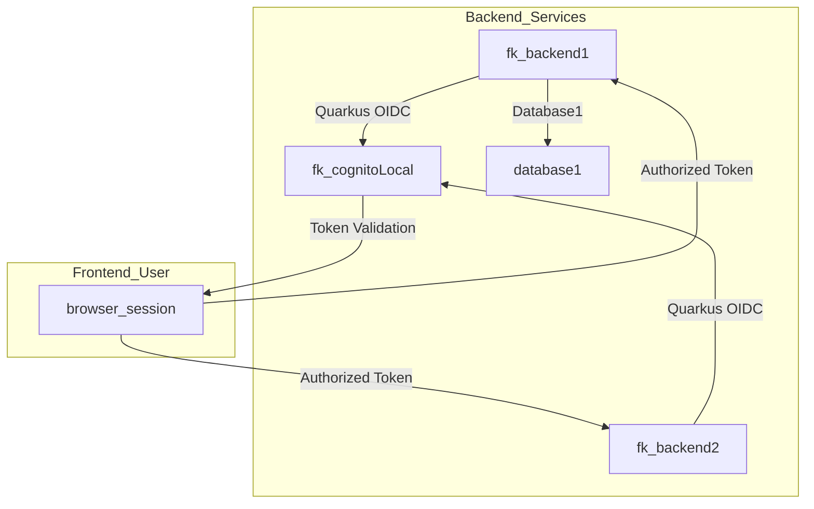
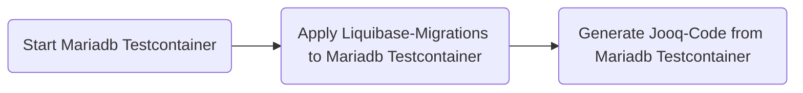
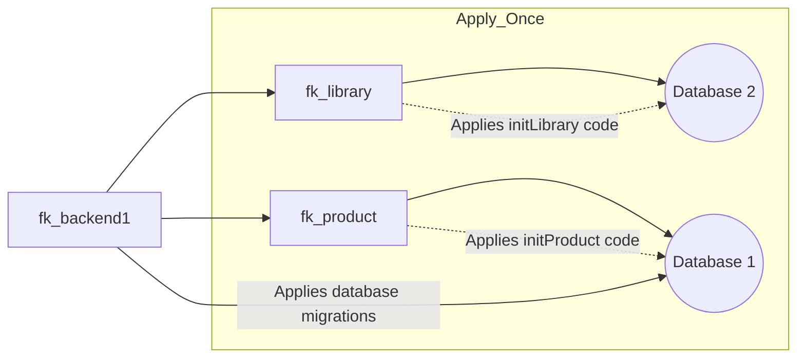
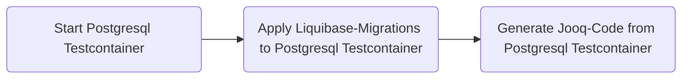
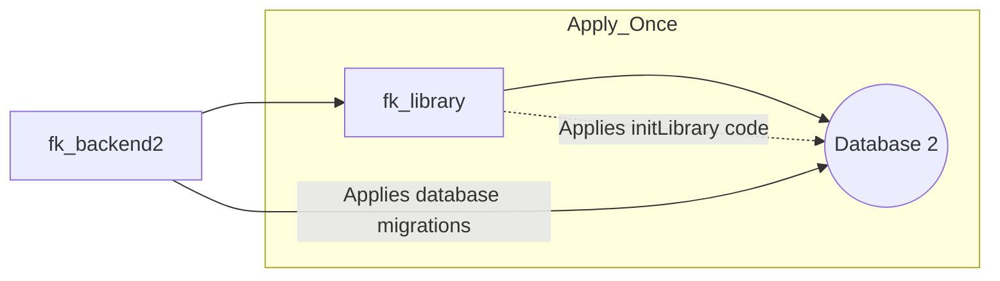
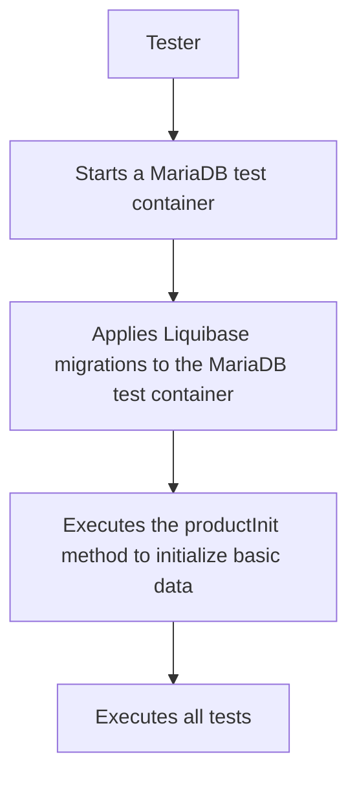

# Quarkus demo: jOOQ with Liquibase, RESTEasy, Gradle, Testcontainers

This is an example of a Mono-Repo Multi-Module Project, that can be a starter for the typical 
SaaS Project-Teams-Approach, where several Project-Teams work on a SaaS-Application in the context
of a mid-sized company, where the teams want to start with a Modular Monolith because it is easier to maintain,
but need a good modular separation between the Project-Teams, and an easy splitting of modules into
separate microservices, as soon as this is becoming more relevant, when the teams are growing.

Instead of using the typical Hibernate/ORM, we will explore jOOQ Object Oriented Querying and the possible benefits 
of using such a more dynamic approach to database operations in a multi-tenancy + multi-language context.

Under the hood, the code is using:
- Quarkus Framework
  - RESTEasy to expose the REST endpoints
  - JUnit5 Unit-Testing
  - Db-Transactions safely coordinated by the Narayana Transaction Manager
  - Swagger-UI Support
- jOOQ Framework
  - Object Oriented Querying on the database
  - Db-Schema-To-Code-Generator
- Liquibase Db-Migrations
- Mariadb/Postgresql-Testcontainers for Unit-Tests and Code-Generator
- Gradle Build
  - Multi-Module project for shared-libraries approach 
- Core-Libraries
    - own DAO-Abstraction that you can extend from and fine tune.
    - own Pojo-Abstraction with Modified-Fields detection support.
    - own RemotePagination Pojo to use for remote pagination

In the folder `./docs` you can find specific documentations about the different concepts this small seed-project implements, so you can benefit from them.

## Overview

### Multi-Modules Overview 



### Quarkus OIDC with Cognito-Local

The Backend1 and Backend2 Services are using the Cognito-Local Service with Quarkus OIDC to provide Authentication,
and Backend1 also uses the Users-Table in Database1. The Browser will save the Authentication/Authorization. 
The Roles of the User (Simple Authorization) is also saved in the Browser-Session. 



### Backend1 Code-Generator



### Backend1 Database-Changes

Backend1 is the manager of Database1 (is allowed to apply DDL liquibase-migrations to database1).
Backend1 may also initialize the basic-data of all its modules (DML), during startup. 
This will only happen once and only in dev-environment and during Tests.



### Backend2 Code-Generator



### Backend2 Database-Changes

Backend2 is the manager of Database2 (is allowed to apply DDL liquibase-migrations to database2).
Backend2 may also initialize the basic-data of all its modules (DML), during startup.
This will only happen once and only in dev-environment and during Tests.



### Testing with Testcontainers



## Requirements

### Installations

To compile and run this demo you will need:
- JDK 21+ (Eclipse Temurin)
  - Note: GraalVM is currently not supported for native-build, because some libraries have compatibility-issues
    - awssdk
    - jooq
- Docker / Docker-Compose
- Optional: Quarkus Plugin in Intellij-IDEA

The project has been set up specifically with Intellij IDEA compatibility in mind.

### Configuring JDK 21+

Download the Eclipse Temurin JDK 21 installer for your platform from:
- https://adoptium.net/installation/

Make sure that the `JAVA_HOME` environment variables have
been set, and that a JDK 21+ `java` command is on the path. This is also important if you use Intellij IDEA.
It is recommended to use a tool like sdkman for easy JDK-selection. 

## Setup/run server for local development

### Create database1

you can start up a mariadb database-instance for this if you do not already have one preset (it also creates the database `testshop`, that you can connect to):
```
docker-compose -f _databases/fk_database1/docker-compose-database1.yml up --build -d
```
After starting, you can connect to it with:
- host: localhost:1763
- user: root
- pass: changeme

### Create database2

you can start up a postgresql database-instance for this if you do not already have one preset (it also creates the database `testlibrary`, that you can connect to):
```
docker-compose -f _databases/fk_database2/docker-compose-database2.yml up --build -d
```
After starting, you can connect to it with:
- host: localhost:1764
- user: mydbuser
- pass: changeme

### Create application.properties

Within the folder `_services/fk_backend1/src/main/resources/`, copy the file `./templates/application.properties` to `./application.properties`, 
then edit this newly created file `_services/fk_backend1/src/main/resources/application.properties` in your editor of choice 
and replace the following settings ([port], [username], [password])  for a connection with: 
- database1: your mariadb-database with your settings.
- database2: your postgresql-database with your settings.

```code
quarkus.datasource.database1.jdbc.url=jdbc:mariadb://localhost:[port]/testshop?useCursorFetch=true&rewriteBatchedStatements=true
quarkus.datasource.database1.username=[username]
quarkus.datasource.database1.password=[password]

quarkus.datasource.database2.jdbc.url=jdbc:postgresql://localhost:[port]/testlibrary
quarkus.datasource.database2.username=[username]
quarkus.datasource.database2.password=[password]
```
Do the same for `_services/fk_backend2`.

### Setup/run Cognito-Simulator

The example wants to show how to do Authentication and Authorization with an OIDC Provider.
To make it easy for local development, we will use an offline emulator for Amazon Cognito here.
The official offline emulator (`localstack`) can not be used, because most features would require a professional license.
Therefor we will use the `cognito-local` offline emulator:
- https://github.com/jagregory/cognito-local

We will first start `cognito-local` as a docker-container running on port 9229. Open up a console within the root-folder
of this project and enter following command:
```
docker-compose -f _services/fk_cognitoLocal/docker-compose-cognitoLocal.yml up --build -d
```

Start the cognitoLocalSetup task from the Console with following command:
```code
./gradlew cognitoLocalSetup
```
please note down the following three outputs of this task:
- cognitolocal.userpoolid
- cognitolocal.userpoolclientid
- cognitolocal.userpoolclientsecret

copy those three outputs directly into your `fk_backend1/src/main/resources/application.properties` file.
For example:
```
# cognito-local
cognitolocal.userpoolid=local_7GsYn8Qh
cognitolocal.userpoolclientid=67jqekw6w9193e8khcu9d5slh
cognitolocal.userpoolclientsecret=6sjqzo1wyemkrjecj4qlqembt
```
Quarkus will take care of the JWT-Verify, for the JWT that has been created by a successful AWS-Cognito Authentication.
We need to tell it where to get the OIDC configuration. So make sure that your `application.properties` file also contains the following configurations from the template
(please insert the correct value for <cognitolocal.userpoolid>):
```
# quarkus oidc
quarkus.oidc.auth-server-url=http://localhost:9229/<cognitolocal.userpoolid>
quarkus.oidc.discovery-enabled=false
quarkus.oidc.jwks-path=http://localhost:9229/<cognitolocal.userpoolid>/.well-known/jwks.json
quarkus.oidc.roles.role-claim-path=custom:fk_roles
```

Do the same for `_services/fk_backend2`.

### Run the server

For the first start, please start the service `backend2` first, because `backend1` also connects to `database2` and 
`backend2` needs to apply the db-migrations first on `database2` for it to be usable by `backend1`.

If you use Intellij, you can simply use the starters for the `backend2` and `backend1`,
otherwise, start the Backends from the Console with following commands:
```code
./gradlew --console=plain quarkusRun -p _services/fk_backend1
./gradlew --console=plain quarkusRun -p _services/fk_backend2
```
You can then navigate your webbrowser directly to the swagger-ui or dev-ui.

Backend1:
- http://localhost:8000/q/swagger-ui/
- http://localhost:8000/q/dev-ui/

Backend2:
- http://localhost:8001/q/swagger-ui/
- http://localhost:8001/q/dev-ui/

## Setup/run Unit-Tests for local development

### Run the Unit-Tests

In Intellij you can just start the Unit-Tests as usual. 
Alternatively you can start them via the console with following command:

```code
./gradlew test
```
The testing-framework will fire up a mariadb/postgresql-testcontainer automatically and will apply the liquibase-migrations to it.
This way the Unit-Tests can expect a real database to be available behind the tested code, 
and with the help of jOOQ the expected database-content can be validated after each test.

## Maintaining Database-Migrations

### Apply Liquibase-Migrations

You can place the liquibase-migrations in the folder `_databases/databaseX/src/main/resources/databaseX/liquibase` (replace X with the number of your choice).
For each new migration you can add a new file `feature-xxxx.xml` with replacing xxx with your ticket-id from your 
version-control system (gitlab), to relate your database-migrations to your tickets.

You also need to add this identifier in the file `changelog.xml` in the same folder, to make it clear to 
liquibase in which sequence the migration-files need to be applied (latest at the bottom).

The Liquibase-Migrations are automatically applied when the Quarkus-Application is started 
(as defined in `application.properties` with the `quarkus.databaseX.liquibase.migrate-at-start=true` parameter)
While the Liquibase-Migrations are part of the database-projects, the Rollback-Functionality is a task that is defined on the services-projects,
because the services, define the concrete database, and a rollback is an activity on the concrete database-instance.
You can find the Rollback-Task in `_services/fk_backend1/build.gradle`.

It is often convenient in local-dev, to be able to rollback to a specific tag, if you want to switch your git-branch, that you are working on.
For this use-case a gradle-task is provided, that helps you to rollback your database to a specific changeset. 
This will automatically execute all rollbacks of already applied changesets until the tag-changeset is reached.
```code
./gradlew backend1Database1Rollback -ProllbackTag=feature-1122
./gradlew backend2Database2Rollback -ProllbackTag=feature-3823
```
This example would rollback all migrations that followed after the file `feature-1122.sql` in database1 (mariadb) and all migrations that
followed after `feature-3823` in database (postgresql).

The typical workflow would consider of first rolling back your changesets by rolling back to the latest changeSet-tag in the dev-branch. 
Then you would switch branches to another feature branch, and start the quarkus-application, so all changeSets of this branch are applied to your database.

Note: Rollback is only relevant/helpful for local-dev, you never! want to use this with any other environment (staging, production).

### Running the jOOQ Code-Generator

After all database-changes via liquibase-migrations, the codegen must be executed, to recreate the database-specific code. 
Each database gets its own folder. We have `fk_database1` as example. But more database-folders would be possible. 
Each such folder would have an own code-generator command to call it then.

Start the jOOQ Code-Generator from the Console with following command:
```code
./gradlew generateDatabase1JooqCode
./gradlew generateDatabase2JooqCode
...
```
The generated code will reside in the folder `_databases/fk_databaseX/src/main/generated`. 
The generator will fire up a mariadb/postgresql-testcontainer automatically, apply the liquibase-migrations to it 
and will then generate the code from this database-schema. Afterwards the testcontainer is stopped again.

You also need to commit this generated code into your version-control system, as it is used within your code.

## Dockerizing the application

The first step is, to prepare the `_services/fk_backend1/src/main/resources/application.properties` file to be ready for the deploy
within the docker-container. Note that, normally you would prepare this file within a ci-pipeline (like in gitlab for example),
so it is already prepared with the correct settings for the live-environment.

For testing it, we can replace all `localhost` occurrences with a host/port that would be reachable from within
the docker-container. For our example this would be:
- fk-db1 for database1 (mariadb)
- fk-db2 for database2 (postgresql)
```
fk-db1:3306
fk-db2:5432
```

Next, build the JAR-files with following command. It will execute the tests and build everything.
```shell script
./gradlew build
```
The build produces the `quarkus-run.jar` file in the `_services/fk_backend1/build/quarkus-app/` directory along with other files,
and also with our prepared `application.properties`. 

Finally, we can build the docker-image and start it as docker-container by executing the docker-compose file as follows:
```shell script
docker-compose -f _services/fk_backend1/docker-compose-backend1.yml up -d --build
```
This will start up a docker-container build with the `_services/fk_backend1/src/main/docker/Dockerfile.jvm` which will use the `_services/fk_backend1/build/quarkus-app/` directory, we have created with our build and start up the `quarkus-run.jar`
After the docker-container has started we can open a rest-route in our webbrowser and it should work:
- http://localhost:8000/products/1

## Gitlab-Deploy

As example for deployment of this multi-services project, we use Gitlab Downstream-Pipelines. See:
- https://docs.gitlab.com/ee/ci/pipelines/downstream_pipelines.html

The entrypoint is: `.gitlab-ci.yml`. 

When you want to test this deployment you must first make sure that the docker-network `fk-framework` exists on the target-system,
where the containers will be deployed to. It can be created as follow:
```
docker network create fk-framework --attachable
```

Afterwards you can push this code to gitlab, and adjust the gitlab-ci files and referenced docker-compose files to your needs.
They have been tested to work, but may need small adjustments for your system.

## Intellij IDEA

All the described operations can also be started up from within the Intellij IDEA.
1. Make sure that the project does not contain the subfolders: `.idea` and `.gradle`, and also delete all `build` folders within the projects subdirectories. 
2. Now open the project via `File`->`Open`.
3. The project should now be build automatically.

## Third-Party Versions Balancing

The used versions of third-party libraries must be balanced with each other. 

Use the jOOQ Version, that is fitting for your database or upgrade your database. See:
- https://www.jooq.org/download/support-matrix

We also can check conflicting dependencies, with gradlew. For example. The following command would check the dependency `validation-api` in our module `fk_backend1` and show as all versions of this (possibly transitive) dependency in the runtime classpath: 
```code
./gradlew -p _services/fk_backend1 dependencyInsight --dependency validation-api --configuration runtimeClasspath
```

## Quartz

Table-SQLs for your database type (mariadb, ...) are hidden in the quartz repositories. See:
- https://github.com/quartz-scheduler/quartz/blob/quartz-2.3.x/quartz-core/src/main/resources/org/quartz/impl/jdbcjobstore/tables_mysql_innodb.sql

## ULID

we are assuming that our SaaS will have a medium-size in regards to client and user-base.
- The UUID must be able to be encoded in a way that it is short and readable by the user
- It is helpful if the UUID is sorted by creation-time.
- we do not want to manage the complexity of TSID, in regards to giving each node a unique id (dev-ops maintenance).
- UUID is too long to be encrypted in a way that it is readable for the user (even with base32/crockford).

For those reasons ULID is chosen here.

## Multi-Project Build with Quarkus

All Modules should contain a `src/main/resources/META-INF/beans.xml` file. 
This file can be used instead of Jandex to declare that all beans in the project need to be discovered for DI.

In all projects that contain QuarkusTest tests, we need to use the quarkus-plugin in the gradle-file:
- `id 'io.quarkus'`
and we also need to define the dependency to the quarkus bom:
- `implementation enforcedPlatform(libs.quarkusPlatform)`

As soon as we do so, the `./gradlew build` command will get an error, 
because the quarkus-plugin seeks if all `@Inject` annotations, can be resolved (during build-time? why?).
To make the quarkus-plugin accept our project in the build we need to provide the project a `src/main/resources/application.conf` file,
that contains only the following line, so the `@Inject` for the DataSource can be resolved. 
```
quarkus.datasource.active=false
quarkus.datasource.database1.db-kind=mariadb
quarkus.datasource.database2.db-kind=postgresql
```
See also:
- https://stackoverflow.com/questions/78245861/quarkus-gradle-multi-project-build-modular-testing-build-problem

## Related Guides
- Liquibase ([guide](https://docs.liquibase.com/concepts/home.html)): Handle your database schema migrations
- Gradle+Quarkus ([guide](https://quarkus.io/guides/gradle-tooling)): Building quarkus apps with gradle
- Gradle+IDEA ([gradle-guide](https://docs.gradle.org/current/userguide/idea_plugin.html), [idea-guide](https://www.jetbrains.com/help/idea/work-with-gradle-projects.html#project_encodings)): Setting up gradle with IDEA
- jOOQ ([guide](https://www.jooq.org/doc/3.18/manual/)): Handle your database querying
    - Insert/Update Only Changed-Values ([read](https://blog.jooq.org/orms-should-update-changed-values-not-just-modified-ones/)): Read about the topic why ORMs should update "changed" values, not just "modified" ones.
- Cognito-Local ([guide](https://github.com/jagregory/cognito-local)) Free Offline AWS-Cognito Emulator. 
- Cognito with OIDC ([guide](https://levelup.gitconnected.com/securing-micro-services-in-quarkus-with-aws-cognito-387990c04100)): Setup Quarkus to use OIDC for JWT-Verify of Cognito-Created JWTs.

## License

This project is licensed under the MIT License - see the LICENSE.md file for details.